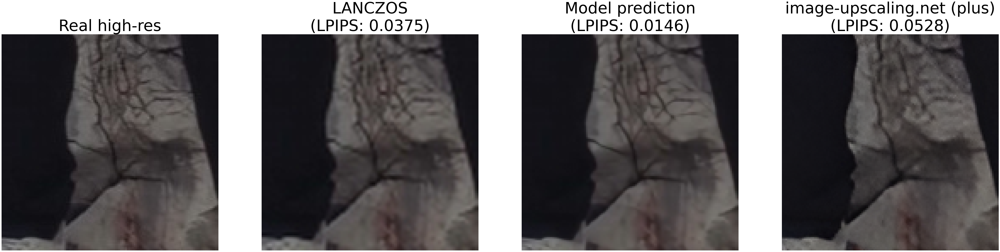
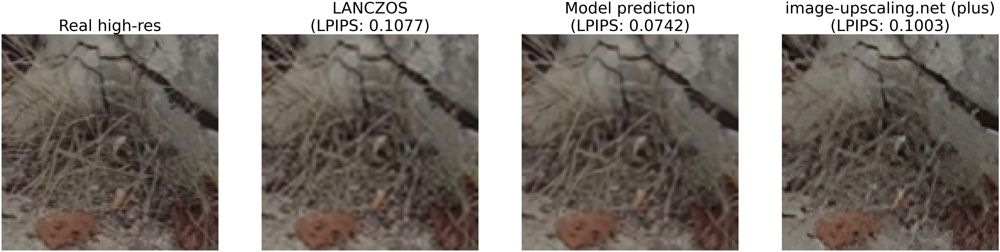
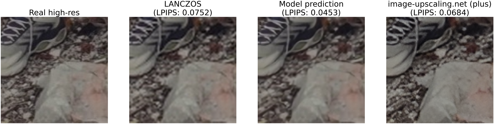

# About PhotoUpscaler

PhotoUpscaler is an educational project for DLS:
https://stepik.org/lesson/2104043/step/1?unit=2134957

It implements a ML model for image SuperRes upscaling (2x scale factor).
This project contains:
- pre-trained model weights
- notebooks for training and testing the model locally
- telegram bot implementation for interactive upscaling

Description of the implementation process is available here: 
[**Detailed Worklog**](worklog.md)

# Inference Examples

Here are some examples comparing image patches scaled by my model, using traditional algorithms and by 3rd party model:

# Usage

**IMPORTANT:** 
Model weights are stored using [**Git LFS**](https://git-lfs.com) (Large File Storage).
Use `git lfs install` before cloning repo, otherwise pre-trained model weights will not be obtained.

### Training the model
- Open the `notebooks/train.ipynb`
- Follow the instructions in the notebook

### Testing the model
- Open the `notebooks/test_patches.ipynb` (for testing raw patches) or `notebooks/test_inference.ipynb` (for testing final image assembling)
- Follow the instructions in the notebook

### Deploying a telegram bot
- Ensure model `upscaler.ckpt` file is presented in the `checkpoints` folder
- Obtain a new bot token from [@BotFather](https://t.me/BotFather)
- Add it to the `.env` file using `BOT_TOKEN=` key
- Run `bot` service via `docker-compose.yml`

