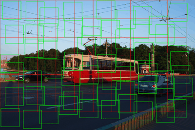
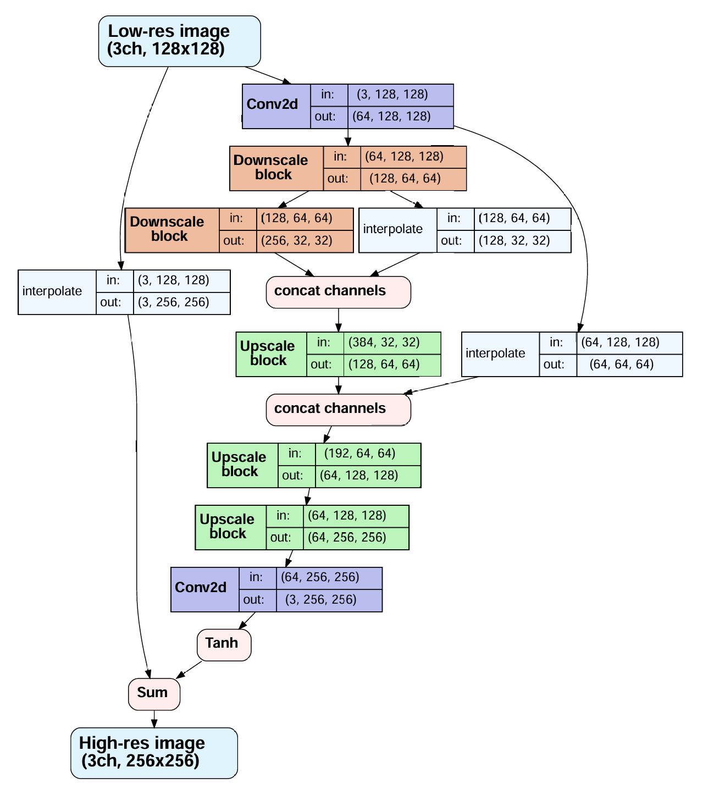

# Project Goals

Project goal was to create a user interface for the model inference. Following applications were proposed to be implemented:
- Image stylization, style transfer
- Super resolution
- Any similar task

Since I've spent more than a decade taking photos with different DSLR cameras I've got about 60K high-res photos available. So I've decided to opt in a SuperRes challenge and to rely on my own data only. A subset containing around 5K photos in 21MP resolution was chosen to be a train dataset.

Relying on my own data and computational resources was crucial for me. Nowadays it's easy to take someone's intermediate results and get a stunning quality without understanding the basics. But since it's an educational project I've focused mostly on implementing everything from scratch. I can't overcome industry-standart state-of-the-art upscalers available online and trained on much more complex data, but I can implement my own model and understand core concepts more deeply.

# Roadmap

Milestone goals:
- Implement a dataset based on my photo archive (retreive patches from photos)
- Implement a CNN architecture for 2x upscaling
- Train a model locally on 4070Ti GPU (12Gb VRAM)
- Compare model patch output to classic upscaling algorithms and to 3rd party models
- Implement an inference: assemble output picture back from patches
- Implement a Telegram bot as a GUI 

## Dataset

First naive implementation of the dataset was:
- load a random photo from the disk
- take one random patch from it
- proceed to the next random photo

But since photos are large enough it lead to huge I/O overhead. GPU was idle about 50% of the training time waiting for CPU to prepare the next batch. 

To reduce I/O bottleneck I've dediced to load the photo and obtain all possible patches from it before proceeding to the next photo. Such approach limits dataset randomization since all patches from the specific photo are processed sequentially but it was the price to nivelate I/O overhead and drastically improve training performance.

Patch obtaining algorithm is shown on a gif below:
- Load high-res photo once
- Compute a **static grid** of patches of size NxN **(red lines)**
- Since the image dimensions are not fully dividable by N, some space is left uncovered on the right and at the bottom
- To effectively cover all the image with patches, each patch is not taken from the static grid but randomly shifted from the grid using the free space uncovered by the grid **(shifted patches = green squares)**
- Patch retrieving order is randomized for each image (slightly different patches are obtained each epoch - illustrated on gif via moving green squares)

Dataset implementation could be found in [model/dataset.py](model/dataset.py)

## Model Architecture

### CNN

I've decided to implement a UNet-like architecture since UNet approach impressed me earlier during the course and I've had high hopes about it. In SuperRes applications, UNet would be helpful to capture multi-scale context while keeping convolution kernels of managable size 3.

Model architecture is shown on a graph below:
- Extend channels from 3 YCbCr to 64
- 2 downscale blocks followed by 2 upscale blocks + skips (UNet pattern)
- Final upscale block for 2X target size increase
- Shrink channels back to 3 YCbCr
- Sum with bicubic base (residual)

Simple CNN blocks are used in this model.

Downscale block:
- Chain of conv2d + relu
- Avg pooling to reduce spatial size

Upscale block:
- Chain of conv2d + relu
- Pixelshuffle to increase spatial size

Skip connections include nearest downscale to match spatial dimensions.

Model implementation could be found in [model/unet_upscaler_v1.py](model/unet_upscaler_v1.py)

### Color space

As for color space, YCbCr was chosen instead of RGB to reduce channel correlations and to focus on Y channel which is more important for perceptual quality. 

**ITU-R BT.709** specification was used to convert images from source RGB space.

Color space convertions are described in [model/image_utils.py](model/image_utils.py)

For more details about color space convertions see https://web.archive.org/web/20120403123714/http://www.equasys.de/colorconversion.html

### Loss

#### L1 (primary)

L1 distance between upscaled LR (low-res) and target HR (high-res) was chosen as a primary loss. It was split into 2 components: for Y channel and for CbCr channels. Y channel is then pripritized in the summary loss.

$$L_1 = \lambda_y \left\| Y_{HR} - Y_{LR}\right\|_1 + \lambda_{CbCr}\left\| CbCr_{HR} - CbCr_{LR}\right\|_1$$

When used alone, it allows model to tend to predict 'average' values to expand 1 pixel into 2x2 block. Model can't know the exact texture pattern in the high-res target and it tends to generate some blurry average pixels instead of trying to be brave and generate more solid micro-texture, because every large error in micro-texture will punish the model more than the average error of a blurry pixel block.

**To reduce prediction blurriness, gradient and laplasian loss components were introduced.
It helps the model preserve edges, textures and sharp transitions.**

#### Gradient loss (Scharr)

Scharr operator is used to compute image gradients along X and Y directions. Convolution kernels:

$$
K_x = \frac{1}{16}
\begin{pmatrix}
-3 & 0 & 3 \\
-10 & 0 & 10 \\
-3 & 0 & 3
\end{pmatrix},
\qquad
K_y = K_x^{\top}
$$

Image gradients are computed per-channel using convolution:

$$
G_x(x) = x * K_x
$$

$$
G_y(x) = x * K_y
$$

The gradient loss is defined as the sum of L1 distances between
predicted and ground-truth gradients:

$$
\mathcal{L}_{\mathrm{grad}}(x_{\mathrm{pred}}, x_{\mathrm{gt}})
=
\left\| G_x(x_{\mathrm{pred}}) - G_x(x_{\mathrm{gt}}) \right\|_1
+
\left\| G_y(x_{\mathrm{pred}}) - G_y(x_{\mathrm{gt}}) \right\|_1
$$

#### Laplacian loss

In addition, **Laplasian loss** focuses on high-frequency details like edges and fine textures. It also punishes blurry results.

Simple discrete Laplacian filter is used. It's kernel:

$$
K_{\Delta} =
\begin{pmatrix}
0 & 1 & 0 \\
1 & -4 & 1 \\
0 & 1 & 0
\end{pmatrix}
$$

It is applied per-channel using convolution:

$$
\Delta x = x * K_{\Delta}
$$

Then the loss is computed as an L1 difference:

$$
\mathcal{L}_{\mathrm{lap}}(x_{\mathrm{pred}}, x_{\mathrm{gt}})
=
\left\| \Delta x_{\mathrm{pred}} - \Delta x_{\mathrm{gt}} \right\|_1
$$

#### Loss summary

As a result of using L1 + Gradient + Laplasian losses, model is not so blurry like some models found online (ugly solid-fill plastic colors are sometimes observed). Still not as good as the original high-res patches, but my model is not the magic one. It does not utilize GAN approach and does not introduce completely new data from nowhere. 

I've tried using more losses than described above but with no much effort, so they are not described here in details. That includes:
- Invariant tiny loss 3x3 to improve micro-textures without punishing for the wrong micro-pattern orientation
- Anti-checkerboard loss (I was trying to reduce square-like patterns on micro scale but with no much luck - proper patch assembling and blending helped much more)

Loss implementations could be found in [model/loss.py](model/loss.py)

## Training a model

Lightning wrapper is used to implement the training loop. Tensorboard is used to monitor training progress and charts in runtime. Nothing special here. 

I've tried multiple variations of model hyperparams and even architectural changes. The best model I've managed to train is described above. It is UNet-like residual net with 2 downscale blocks, 3 upscale blocks and 2 chained convolutions in each block.

Training took about 10 hours on 4070Ti GPU (12 Gb VRAM).

## Output Patch Comparison

I've compared model's output to classic Lanczos algorithm, real high-res and to the 3rd party model result (https://image-upscaling.net/upscaling/en.html):

**My model is definitely better than Lanczos.** Lanczos has aliasing problems on hard edges. Ok, there is some sense of using deep network instead of just applying a simple formula.

**Comparing to image-upscaling.net,** my model is more blurry, still handling lines better. It is sometimes good sometimes bad. 3rd party model tends to generate details that are far away from the original high-res image and it's bad when comparing them side-by-side. Still it's not bad when you don't have an original high-res (why would you upscale something when you do?). My model is much simplier and it does not introduce much more to the picture.

**Comparing to the real high-res patches,** my model is accurate enough in handling overall color and luminance. No shifting colors, less contrast due to the lack of micro-textures, but still very close to the original one.

## Inference

Inference code is implemented as a separate module in [model/inference.py](model/inference.py). What it does:
- Breaks low-res picture into overlapping patches
- Passes low-res patches through the model
- Assembles high-res patches back to the final image

Patches are overlapping to prevent artifacts on patch borders. Blending mask is used instead and patches are mixed proportionally.

## Telegram bot

There is no much to say about the telegram bot code since it's about 3% of the project complexity.

Bot code is located in [bot/app.py](bot/app.py). Bot handles user messages, accepts any picture format, passes it through the model and sends back the upscaled pic.

Bot is wrapped into the docker container so it could be deployed easily on any machine with a GPU.